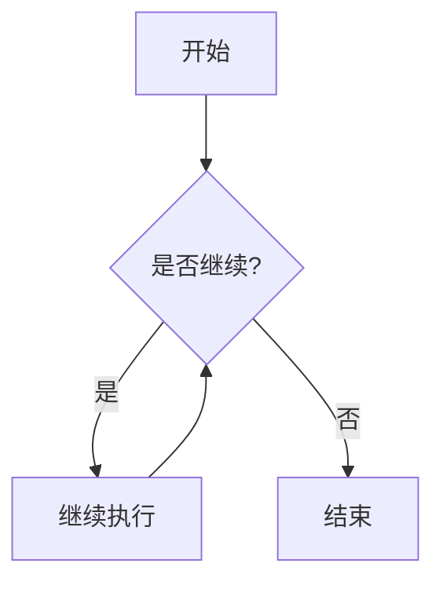
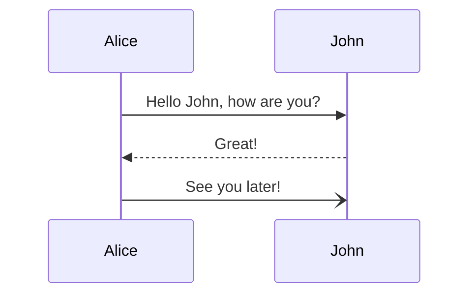

# GFM 完整语法演示

   ## 1. 基础格式化

这是**粗体**文本，这是*斜体*文本，这是~~删除线~~文本，这是***粗斜体***文本。

---

## 2. 标题层级

# H1 - 一级标题
## H2 - 二级标题
   ### H3 - 三级标题
#### H4 - 四级标题
##### H5 - 五级标题
###### H6 - 六级标题

---

## 3. 列表

### 无序列表
- 项目一
- 项目二
  - 子项目 2.1
  - 子项目 2.2
- 项目三

### 有序列表
1. 第一步
2. 第二步
   1. 子步骤 2.1
   2. 子步骤 2.2
3. 第三步

### 任务列表（GFM 扩展）
- [x] 已完成的任务
- [x] 另一个已完成任务
- [ ] 未完成的任务
- [ ] 待办事项

---

## 4. 表格（GFM 扩展）

| 姓名 | 年龄 | 城市 | 备注 |
| :--- | :---: | ---: | :--- |
| 张三 | 25 | 北京 | 工程师 |
| 李四 | 30 | 上海 | 设计师 |
| 王五 | 28 | 深圳 | 产品经理 |

### 表格对齐示例
| 左对齐 | 居中对齐 | 右对齐 |
| :--- | :---: | ---: |
| 内容 | 内容 | 内容 |
| 左 | 中 | 右 |

---

## 5. 代码块和语法高亮

### 行内代码
使用 `console.log('Hello')` 输出内容。

### 代码块（带语言标识）
   ~~~js  
// JavaScript 示例
function greet(name) {
  return `Hello, ${name}!`;
}

const result = greet('World');
console.log(result);
~~~

```python
# Python 示例
def greet(name):
    return f"Hello, {name}!"

result = greet("World")
print(result)
```

```bash
# Shell 命令
npm install marked
node index.js
```

```json
{
  "name": "GFM Demo",
  "version": "1.0.0",
  "dependencies": {
    "marked": "^4.0.0"
  }
}
```

---

## 6. 引用块

   >    这是一段标准引用
> 
> 引用可以包含多行内容。

> 嵌套引用：
>> 第二层引用
>>> 第三层引用

---

   ## 7.     引用（Blockquote）中的 GFM 语法

> **注意**：引用块中也可以使用 GFM 语法！
> - 列表项一
> - 列表项二
> 
> 代码：`inline code`
> 
> ```javascript
> console.log('代码块也可以！');
> ```

---

## 8. 链接

### 标准链接
    [访问 GitHub](https://github.com)

### 自动链接（GFM 扩展）
https://www.example.com

https://github.com/you/repo

### 邮箱自动链接（GFM 扩展）
user@example.com

support@github.com

### 引用式链接
[Google][1] 是一个搜索引擎。

[1]: https://www.google.com

   ---

## 9. 图片

### 标准图片


### 带标题的图片


### 图片链接
[](https://github.com)

---

## 10. 删除线（GFM 扩展）

  ~~这段文字被删除了。~~

~~这是错误的内容~~，这是修正后的内容。

---

   ## 11.     脚注（GFM 扩展）

这是包含脚注的文本[^1]，这里还有另一个脚注[^2]。

[^1]: 这是第一个脚注的内容。
[^2]: 这是第二个脚注，可以包含多行内容。
    第二行内容。

---

## 12. 表情符号（GFM 扩展）

:smile: :heart: :tada: :rocket: :sparkles:

:warning: :information_source: :white_check_mark: :x:

:octocat: :shipit: :metal:

---

## 13. 提及用户（GFM 扩展）

@github 团队 @用户名

@octocat 请查看这个 PR。

---

## 14. 引用 Issue 和 PR（GFM 扩展）

修复了 #123 和 #456 的问题。

相关 PR: #789

需要查看 issue #42 的详情。

---

## 15. 警告（GFM 扩展，GitHub 特有）

   >    [!NOTE]
> 这是一个提示信息，提供有用的补充说明。

> [!TIP]
> 这是一个实用技巧，可以帮助你更高效地使用功能。

> [!IMPORTANT]
> 这是一个重要信息，需要特别注意。

> [!WARNING]
> 这是一个警告，可能存在风险。

> [!CAUTION]
> 这是一个警示，需要谨慎操作或避免错误。

---

## 16. 折叠区块（HTML 标签）

<details>
<summary>点击展开查看详情</summary>

这里是折叠区块内的内容。

- 可以包含列表
- 可以包含代码
  ```javascript
  console.log('折叠内的代码');
  ```
- 支持各种 Markdown 语法

</details>

---

## 17. 转义字符

使用反斜杠转义特殊字符：

\*这不是斜体\*

\# 这不是标题

\[这不是链接\]

\(这不是括号\)

\{这不是花括号\}

\`这不是代码\`

---

## 18. 分隔线

上面已经有分隔线了，这是另一种：

***

---

___

---

## 19. HTML 标签（GFM 支持部分）

<p style="color: red;">这是一个红色的段落（HTML）。</p>

<span style="background-color: yellow;">高亮文本</span>

<div align="center">
  居中的内容
</div>

---

## 20. 组合语法

### 标题内包含格式化
## **加粗的标题** 和 *斜体标题*

### 列表内包含代码和链接
   - 列表项一，包含 **粗体** 和 [链接](https://example.com)
- 列表项二，包含行内代码 `code`
- 列表项三，包含图片 

### 表格内包含格式化
   | 名称 | 描述 | 代码 |
| :--- | :--- | :--- |
| **加粗** | 包含 `代码` | [链接](url) |
| *斜体* | ~~删除线~~ | `console.log()` |

---

## 21. Mermaid 图表（GFM 扩展，GitHub 支持）





---

## 22. 数学公式（GFM 扩展，部分平台支持）

行内公式：$E = mc^2$

块级公式：

$$
\frac{n!}{k!(n-k)!} = \binom{n}{k}
$$

---

## 23. 目录（手动）

- [1. 基础格式化](#1-基础格式化)
- [2. 标题层级](#2-标题层级)
- [3. 列表](#3-列表)
- [4. 表格gfm-扩展](#4-表格gfm-扩展)
- [5. 代码块和语法高亮](#5-代码块和语法高亮)

---

**这就是 GFM 的完整语法演示！** 🎉

## 23. Html
<div>
   <span style="color:red">里面的内容怎么又被识别为markdown了？</span>

 # 里面的Header又被识别了
</div>


<details>
<summary>📖 点击展开查看详情</summary>

这里是折叠区块内的内容。

- 可以包含列表
- 可以包含代码
```javascript
  console.log('折叠内的代码');
  支持各种 Markdown 语法
```
</details> 